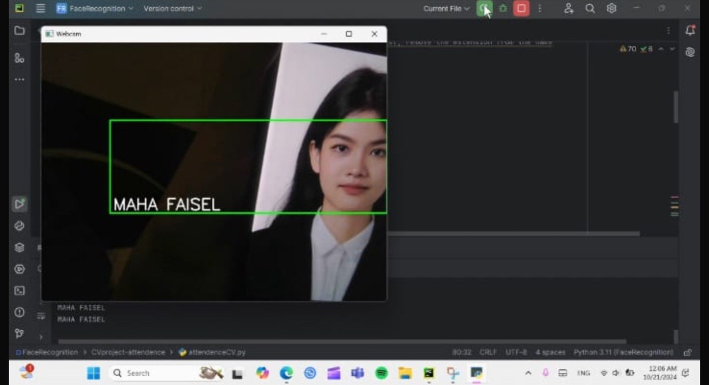
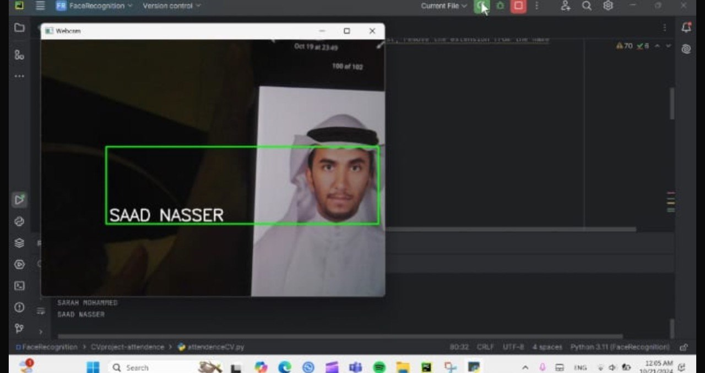
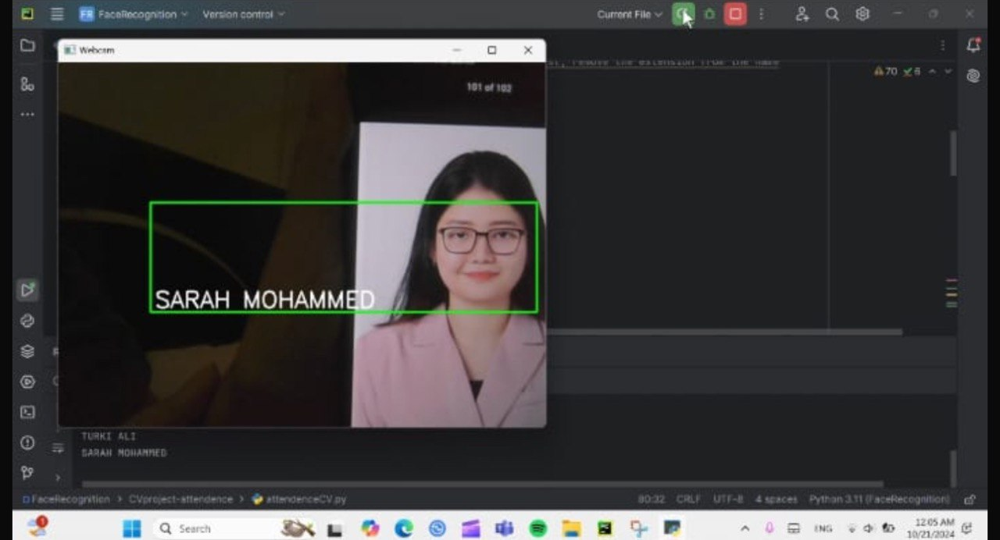
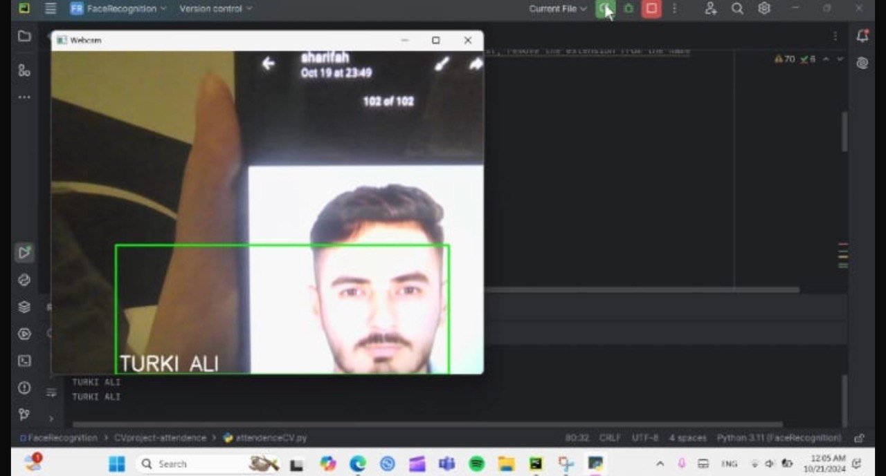

# Smart Face Attendance System

A computer vision system that recognizes student faces in real-time and marks their attendance automatically.

## Features
- Real-time face detection and recognition
- Alerts for unknown faces
- Attendance logging in CSV file
- Displays recognition status on screen
- Easy to scale with new student images

## Tech Stack
- Python
- OpenCV
- face_recognition library
- CSV for data logging

## Screenshots
Here are sample outputs from the face recognition module:

| Detection 1 | Detection 2 |
|-------------|-------------|
|  |  |

| Detection 3 | Detection 4 |
|-------------|-------------|
|  |  |

---

## Flowchart

The following diagram illustrates the flow of the system:

## How to Run
1. Clone the repository
2. Place known student images inside a folder (e.g., Students)
3. Run attendence.py
4. The system will detect and mark attendance in Attendance.csv

## Future Work
- Improve recognition in low light
- Add GUI interface
- Integrate cloud-based storage for attendance
