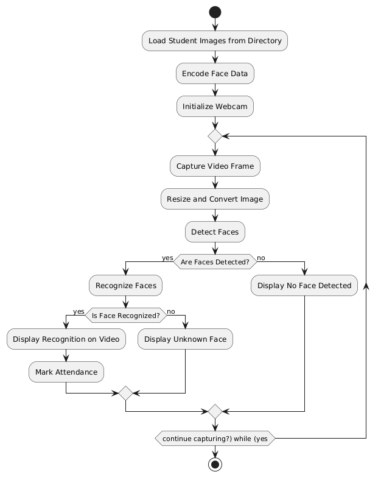

# Face Recognition Attendance System

A computer vision system that recognizes student faces in real-time and marks their attendance automatically using webcam footage.

## Features
- Real-time face detection and recognition
- Alerts for unknown faces
- Attendance logging in CSV file
- Displays recognition status on screen
- Easy to scale with new student images

## Tech Stack
- Python
- OpenCV
- face_recognition
- CSV for data logging

## How It Works
1. Load student images from directory
2. Encode faces and save encodings
3. Start webcam and capture frames
4. Detect and recognize faces in each frame
5. Log recognized names into attendance file
6. Show unknown face alert if face not matched

## Future Improvements
- Add GUI using Streamlit or Tkinter
- Save unknown faces to folder for later review
- Export attendance to Excel with styling
- Daily attendance history and statistics dashboard

## Flowchart

## Demo
(Attach screenshot or gif here showing system in action)

## Screenshots
Add sample images from your project here:
